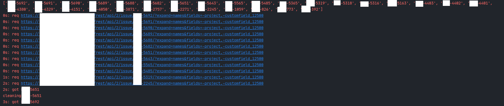

# JIRA RESTful API asynchronous requests

Utilising the JIRA RESTful API to download data asynchronously. 

Leverages aiohttp and asyncio to perform multiple jira api requests simultaneously, reducing need to wait for outcomes of concurrent requests.

Uses a rate limiter to limit the max number of requests at a time to avoid server time outs from the JIRA api.

